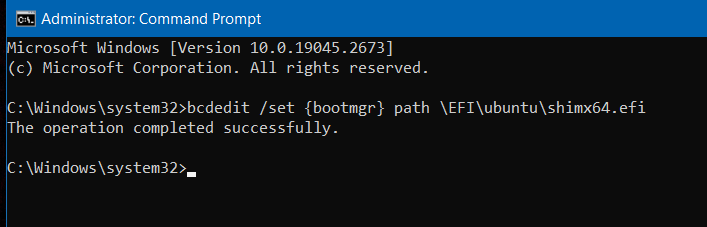
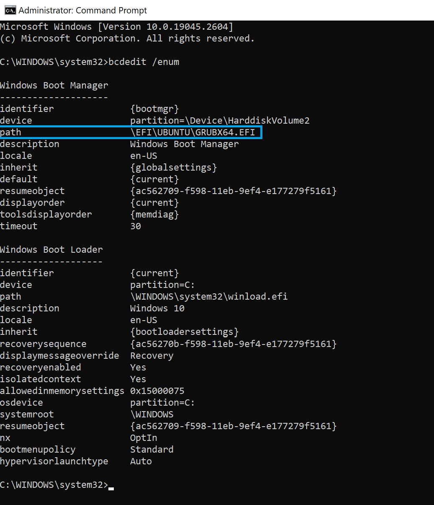
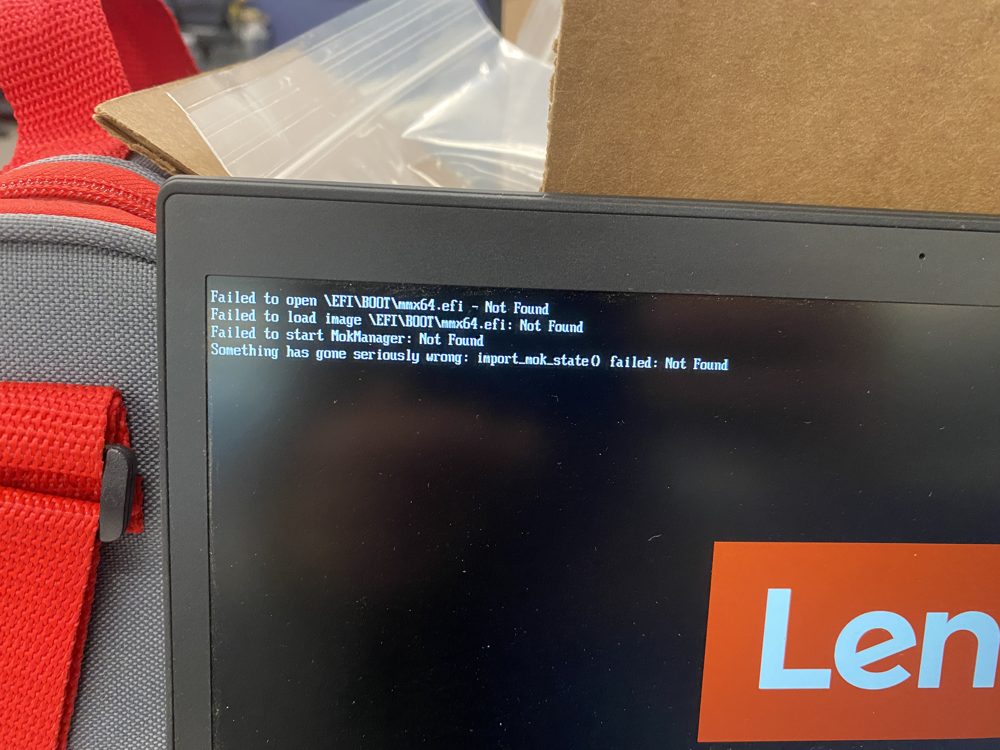

# Dual Boot with Windows

## Useful Facts
- Ubuntu full disk encryption (FDE) is not possible with dual-boot
- Legacy/MBR allows only 4 primary partitions
- GPT (GUID Partition Table) allows 128 primary partitions
- Ubuntu install partitions (for `/` and swap area) can be either primary or logical
- Never defragment an SSD
- **Don't install Ubuntu using a computer that already has Ubuntu, especially if it has a dual-boot. It seems to corrupt the bootloader of the existing install**

## Prepare the Install Disk
- Get a USB drive at least 8GB
- Install the desired Ubuntu image using either [balenaEtcher](https://www.balena.io/etcher) or [Rufus](https://rufus.ie/en/)

## Prepare the Computer
- The drive must be NTFS. FAT32 drives can't be shrunk.
- Backup the entire drive (Windows) if desired
- Shrink the existing drive to make room for the Ubuntu partition
	- Check free space on the drive. You must have at least enough free space as the desired Ubuntu partition size. If not, delete some files.
	- Always do this from within Windows
	- Use Windows Disk Management
		- Control Panel -> "Create and format hard disk partitions"
		- Start -> Run -> "diskmgmt.msc"
	- Right click on the Windows partition -> "Shrink volume"
		- Make the new volume large enough to hold both the Ubuntu install and a swap area
		- Recommend swap partition 1-2x installed RAM
			- [How Much Swap Should You Use in Linux?](https://itsfoss.com/swap-size/)
			- Creating a dedicated swap partition might not be necessary anymore because Ubuntu creates a swap file automatically, but it doesn't hurt to do this. Ubuntu still recognizes it and uses it.
	- If the "Shrink volume" tool provides insufficient space available to shrink, follow these guides:
		- **DO NOT DEFRAGMENT AN SSD.** Only defrag a HDD.
		- You probably don't need to defrag. It takes a long time, so try everything else first. Disk Cleanup had the most impact for me.
		- Empty recycle bin
		- [How to Get Around Windows’ “Shrink Volume” Inadequacy Problems](https://www.howtogeek.com/721/working-around-windows-vistas-shrink-volume-inadequacy-problems/)
		- [[Fix] “Cannot shrink a volume beyond the point” when Resizing a Partition Using Disk Management](https://www.winhelponline.com/blog/you-cannot-shrink-volume-beyond-point-disk-mgmt/)
		- [Can't Shrink Volume on Windows 10! Here Are Solutions! [Partition Manager]](https://www.partitionwizard.com/partitionmanager/cannot-shrink-volume-win10.html)
	- When this is done, you should have a new "free space" / "unallocated" partition large enough to hold the Ubuntu partition and a swap partition.

## Install Ubuntu

### UEFI Method

This method is preferred. It is also required if the Windows system is already set up for UEFI boot.
- Follow this guide:
	- [How to Install Ubuntu With Dual Boot (Easy Step-wise Guide)](https://bhrigu.medium.com/how-to-install-ubuntu-with-dual-boot-easy-step-wise-guide-5bffddb8b548)
	- This guide is for Legacy/MBR installs, but 99% of it is the same, and it's a great simple guide
	- Make all new partitions logical. They can be primary, but logical works fine and it avoids potential issues with having too many primary partitions.
- For UEFI installs, don't create the `/boot` partition. Instead, make sure there is an existing "efi" partition from Windows, and if the Ubuntu installer gives you a dropdown to select the location of the boot loader, select the partition with "Windows Boot Manager" (the "efi" partition).
	- There is a partition/directory on each physical bootable disk that contains one or more boot loaders. When you install Ubuntu, the Ubuntu bootloader (Grub) gets added to this partition at `\EFI\ubuntu\`
	- The Ubuntu bootloaders are:
		- `\EFI\ubuntu\shimx64.efi` - Windows signed (preferred)
		- `\EFI\ubuntu\grubx64.efi` - Not signed by Windows
	- If there is NOT an existing "efi" partition, create one.
		- [Ubuntu: UEFI: Creating an EFI System Partition](https://help.ubuntu.com/community/UEFI#Creating_an_EFI_System_Partition)
		- Mount point = `/boot/efi`
		- Size = 200MiB
		- Format = FAT32
		- Flag = "boot"
	- If there is already an "efi" partition, do NOT make another one.

This is what the "Something else" (manual installation) screen should look like in the Ubuntu installer when everything is configured properly.


After clicking "Install Now," review the changes and confirm that only the intended partitions will be formatted.


Other References
- Very detailed guide: [How do I install Ubuntu alongside a pre-installed Windows with UEFI?](https://askubuntu.com/questions/221835/how-do-i-install-ubuntu-alongside-a-pre-installed-windows-with-uefi)
- [Ubuntu: UEFI](https://help.ubuntu.com/community/UEFI)

### Legacy/MBR Method

- Follow this guide:
	- [How to Install Ubuntu With Dual Boot (Easy Step-wise Guide)](https://bhrigu.medium.com/how-to-install-ubuntu-with-dual-boot-easy-step-wise-guide-5bffddb8b548)
	- Make all new partitions logical. They can be primary, but logical works fine and it avoids potential issues with having too many primary partitions.

## Troubleshooting

If you can't boot into Ubuntu after installing on a separate partition, try the following:
- Windows:  Disable hibernate
- BIOS:  Disable fast/quick boot
- Turn OFF Fast Startup
	- Windows 10 -> System Settings -> Power & Sleep -> Additional power settings -> Choose what the power buttons do -> turn OFF "Turn on fast startup (recommended)"
- Set the boot manager to Ubuntu (grub) in Windows
	- [Fix Grub Not Showing for Windows and Linux Dual Boot System](https://itsfoss.com/no-grub-windows-linux/#method-3-set-linux-boot-for-efi-from-windows-last-resort-)

```powershell
# Run as administrator in Command Prompt, not Powershell.

# List current Windows boot configuration.
bcdedit /enum

# Change Windows Boot Manager to Ubuntu (Grub).
# Preferred, Windows signed
bcdedit /set {bootmgr} path \EFI\ubuntu\shimx64.efi
# or
# Not signed by Windows
bcdedit /set {bootmgr} path \EFI\ubuntu\grubx64.efi

# Delete current Windows Boot Manager entry.
# This has not worked for me, but also does not seem to be necessary.
bcdedit /deletevalue {bootmgr} path \EFI\ubuntu\shimx64.efi
# or
bcdedit /deletevalue {bootmgr} path \EFI\ubuntu\grubx64.efi

# Change Windows Boot Manager back to Windows.
bcdedit /set {bootmgr} path \EFI\Microsoft\Boot\bootmgfw.efi
```

If the above works, you will see this success message:



Run `bcdedit /enum` and confirm that Windows Boot Manager is now using `shimx64.efi` or `grubx64.efi`.



- Reinstall Ubuntu:  Make the install partition Logical
- Reinstall Ubuntu:  Make the install partition Primary
- If you get this error, your bootloader file is not located where it should be on the disk, or it has a different name than what the system is expecting.
	- 
	- This happened when I tried booting off my live install USB drive, so somehow the drive got messed up. I fixed this buy just re-flashing the Ubuntu install disk. I could have also fixed it by manually changing the bootloader files on the disk.

## How to Change Grub Boot Order

Change what boots by default when you turn on the computer.
- Method 1 = [Make Windows boot by Default in a Windows + Linux Dual-Boot System](https://www.techmesto.com/set-windows-as-default-in-linux-dual-boot/)
- Method 2 = [grub-customizer](https://pureinfotech.com/dual-boot-ubuntu-windows-10/#customize_ubuntu_grub)

## Removing Ubuntu
- [How to Uninstall Ubuntu from Windows Dual Boot Safely](https://itsfoss.com/uninstall-ubuntu-linux-windows-dual-boot/)