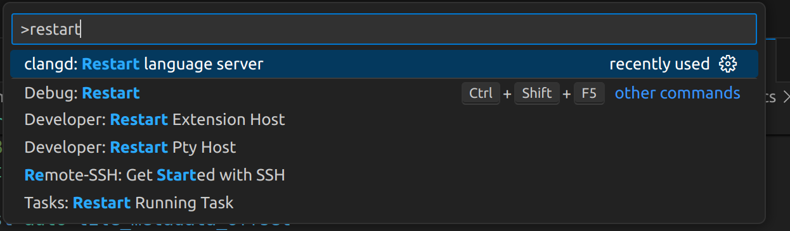

# VSCode

Where VSCode stores settings JSON files (on Windows):

User:

```bash
C:\Users\username\AppData\Roaming\Code\User\settings.json
```

Remote:

```bash
C:\Users\username\.vscode-server\data\Machine\settings.json
```

Workspace:

```bash
...repo\.vscode\settings.json
```

## \`clangd\` Code Analysis

### Step 1

Follow this guide:

[https://github.com/hedronvision/bazel-compile-commands-extractor#vscode](https://github.com/hedronvision/bazel-compile-commands-extractor#vscode)

### Step 2

1. Build your target(s) of interest with bazel at least once to produce any generated code files that may be needed in the next step (eg, c++ files produced from .proto files).
   1. If time is not of the essence (eg, able to run overnight), it can be a good idea to build the whole repo once with `bazel build -c opt //brt/...` to generate all files.
2. Run `bazel run -c opt //:refresh_compile_commands`. Re-run this whenever your build commands change (including new dependencies, new src files, etc)
   1. By default compile commands are generated for all targets in `//brt/...` . If needed, you can modify the `refresh_compile_commands` rule’s `targets` parameter in `shasta/BUILD.bazel` to point to your specific build target(s) with any necessary build flags. This can decrease execution time of refresh\_compile\_commands if needed, but in theory it is run infrequently enough that a few minute execution time seems worth the trade off of generating compile commands for the whole repo by default.
3. Re-build your target once after running `:refresh_compile_commands`. This is needed due to a [change](https://github.com/hedronvision/bazel-compile-commands-extractor/issues/140#issuecomment-1847780405) of [behavior in Bazel 6+](https://github.com/hedronvision/bazel-compile-commands-extractor/issues/140) that has an [open PR](https://github.com/bazelbuild/bazel/pull/20540) to resolve. This build should hit the cache and be quick.

See [this page](https://github.com/hedronvision/bazel-compile-commands-extractor#get-the-extractor-running) for more information and ways to generate the compile\_commands.json if this method is not working for your build target

### Step 3

**Max Gumley:**

After the installation is done, there's a small amount of work to keep the index updated.\
When you make changes to the repo outside of vscode, such as changing branches, running our whitespace formatter, etc, you should call `bazel build` on the part of the project you are working on, e.g:

```
bazel build //path/to:target 
```

Then restart clangd:

Call `clangd: Restart language server` using the vscode F1 interface (CTRL+SHIFT+P)

<figure><figcaption></figcaption></figure>
